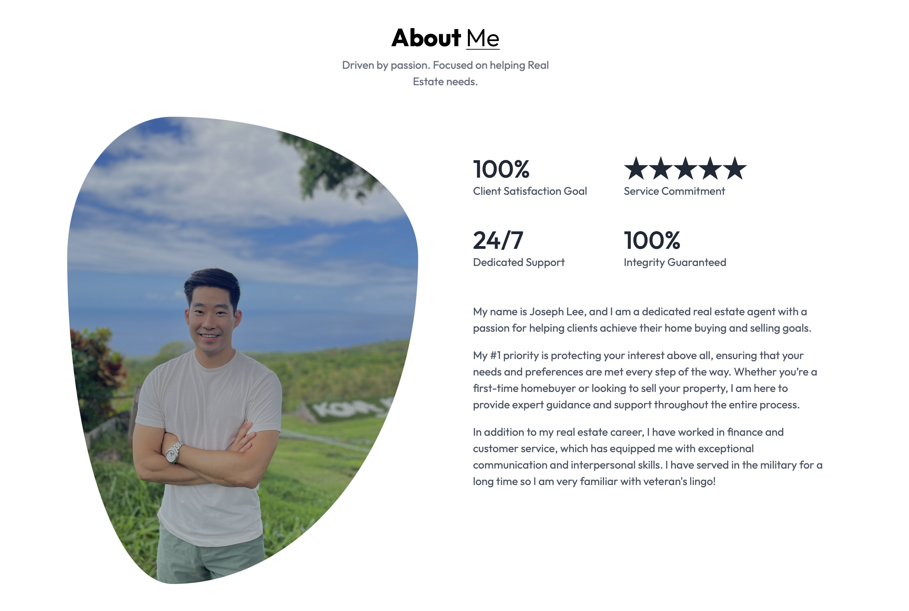
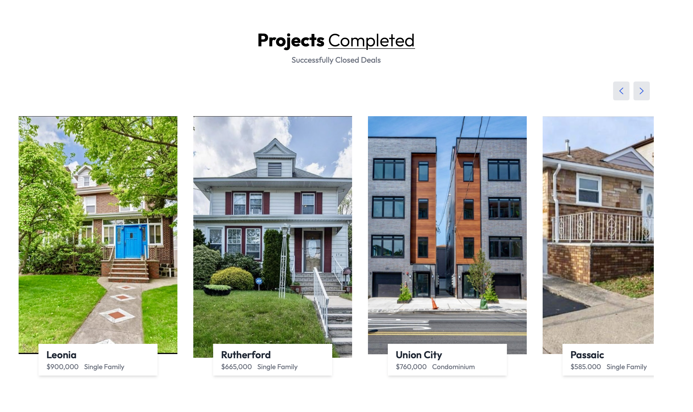
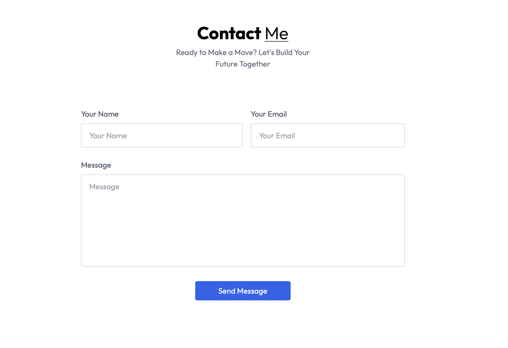

# 🏡 Real Estate Website

[🌐 Live Demo](https://josephleerealtor.com) • [📂 View Code](https://github.com/ashleymichelle5/Real-Estate) • [📧 Contact](mailto:ashleymsanchez5@gmail.com) 

---

## 📖 About The Project

A modern, professional real estate website designed to showcase a real estate agent's portfolio and expertise. This platform serves as a digital business card and portfolio, allowing potential clients to explore the agent's completed assignments, including sold and rented properties, while providing an easy way to get in touch for new opportunities.

### 🎯 Project Vision

In the competitive real estate market, establishing trust and showcasing expertise is crucial. This website was created to:

- **Showcase Agent Expertise** - Display a comprehensive portfolio of successfully sold and rented properties
- **Build Client Trust** - Demonstrate the agent's track record and professional accomplishments
- **Professional Presentation** - Create a polished, modern online presence for the agent
- **Easy Communication** - Enable potential clients to easily contact the agent for consultations
- **Portfolio Management** - Highlight all completed assignments and successful transactions
- **Business Growth** - Attract new clients by showcasing past successes

This platform tells the agent's professional story through their work, making it easy for potential clients to see their experience, specialties, and successful property transactions in both sales and rentals.

---

## ✨ Key Features

- 👤 **Agent Profile** - Detailed bio and professional experience
- 🏠 **Portfolio Showcase** - Complete catalog of sold and rented properties
- 📝 **Client Testimonials** - Reviews and feedback from satisfied clients
- 📱 **Fully Responsive** - Optimized for all devices to reach clients anywhere
- 📧 **Direct Contact** - Web3Forms integration for instant communication
- ⚡ **Fast Loading** - Built with Vite for optimal performance
- 🎨 **Professional Design** - Modern, trustworthy UI with Tailwind CSS
- 🔍 **Property Filtering** - Browse by status (sold/rented), type and location

---

## 🖥️ Screenshots

### Homepage

### Property Details

### Contact Form

---

## 🛠️ Built With

### Core Technologies

### Styling

### Forms & Communication

---

## 📦 Dependencies

| Package | Version | Purpose |
|---------|---------|---------|
| `react` | ^18.x | UI library for building components |
| `react-dom` | ^18.x | React rendering for web |
| `vite` | ^5.x | Next-generation frontend build tool |
| `tailwindcss` | ^3.x | Utility-first CSS framework |
| `@web3forms/react` | ^1.x | React integration for Web3Forms |
| `react-router-dom` | ^6.x | Routing library for React  |
| `react-icons` | ^5.x | Popular icon library |
| `swiper` | ^11.x | Modern slider for property galleries |

---

## 📱 Responsive Design

This website is fully responsive and optimized for:

- 📱 **Mobile** - Seamless experience on phones (320px+)
- 📱 **Tablet** - Perfect layout for tablets (768px+)
- 💻 **Desktop** - Full-featured desktop experience (1024px+)
- 🖥️ **Large Screens** - Optimized for wide displays (1920px+)

---
## 👨‍💻 Author

**Ashley Sanchez**

- 🌐 Portfolio: [ashleymsanchez.com](https://www.ashleymsanchez.com)
- 💼 LinkedIn: [Ashley Sanchez](https://www.linkedin.com/in/ashley-sanchez-029331390/)
- 🐙 GitHub: [@ashleymichelle5](https://github.com/ashleymichelle5)
- 📧 Email: ashleymsanchez05@gmail.com

---
